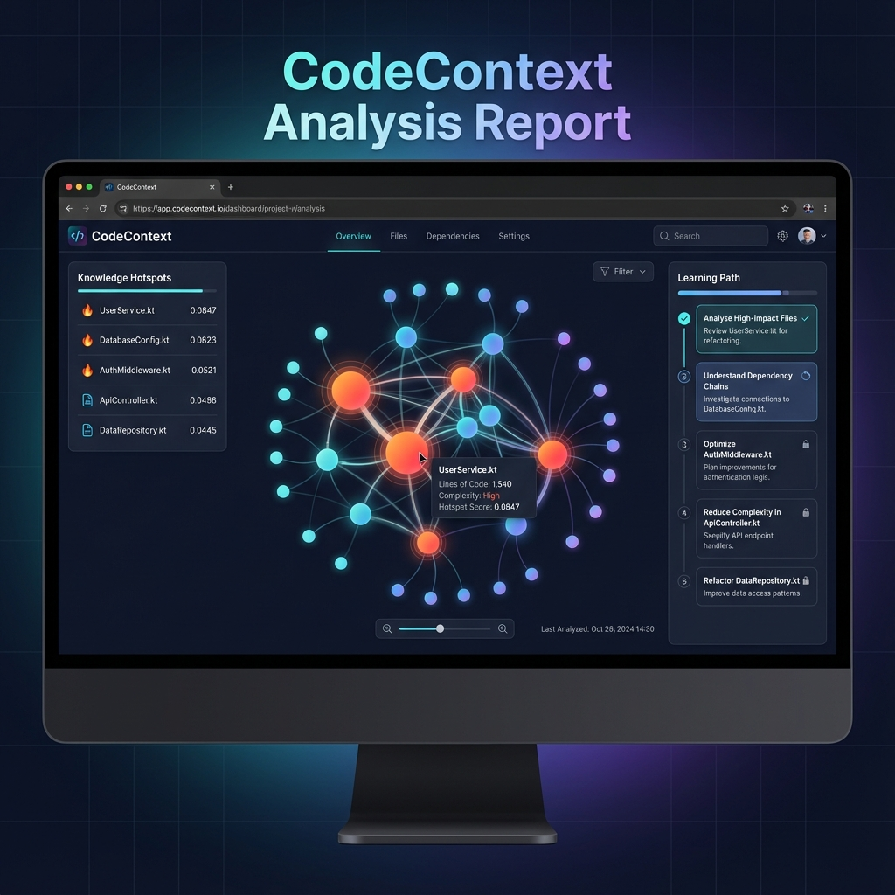

# CodeContext 🎯

> **Intelligent codebase context analyzer for faster developer onboarding**

[](https://kotlinlang.org)
[](LICENSE)
[](https://github.com/sonii-shivansh/CodeContext/actions)
[](CONTRIBUTING.md)

---

## 🚀 Why CodeContext?

**The Problem:** New developers take **1-3 months** to become productive in a new codebase. They waste time:
- 🔍 Searching for "where to start"
- 🤔 Understanding file dependencies
- 📚 Reading outdated documentation
- ❓ Asking repetitive questions

**The Solution:** CodeContext analyzes your codebase in seconds and generates:
- 🗺️ **Interactive dependency maps** - See your entire codebase structure at a glance
- 🔥 **Knowledge hotspots** - Identify critical files using PageRank algorithm
- 🎓 **Personalized learning paths** - "Start here" reading order for new developers
- 📊 **Smart context** - Git history, authors, and change frequency on every file

**Result:** Reduce onboarding time from **3 months → 3 weeks** ⚡

---

## ✨ Features

| Feature | Description |
|---------|-------------|
| 🗺️ **Interactive Dependency Maps** | Zoomable force-directed graphs showing file relationships |
| 🔥 **Knowledge Hotspots** | PageRank algorithm identifies the most critical files |
| 🎓 **Learning Paths** | Topologically sorted "start here" reading order |
| 📜 **Git Integration** | See authors, change frequency, and recent commits |
| 👥 **Team Contribution Map** | Identify knowledge silos and bus factor risks |
| 🌐 **Multi-Language** | Full support for Java & Kotlin (more coming!) |
| ⚡ **Fast** | Parallel parsing with intelligent caching |
| 🎨 **Beautiful Reports** | Clean HTML reports with D3.js visualizations |

---

## 📸 Demo



*Interactive dependency graph with knowledge hotspot highlighting and learning path generation*

**Live Example:** Run `./gradlew run --args="analyze ."` on this repository to see CodeContext analyze itself!

---

## 🚀 Quick Start

### Prerequisites

- **JDK 21+** ([Download](https://adoptium.net/))
- **Git** (for Git history analysis)

### Installation

#### Option 1: Build from Source

```bash
# Clone the repository
git clone https://github.com/sonii-shivansh/CodeContext.git
cd CodeContext

# Build the project
./gradlew build

# Install distribution
./gradlew installDist
```

#### Option 2: Download Release (Coming Soon)

Pre-built binaries will be available on the [Releases](https://github.com/sonii-shivansh/CodeContext/releases) page.

### Usage

#### Analyze a Project

```bash
# Using Gradle (development)
./gradlew run --args="analyze /path/to/your/project"

# Using installed distribution
./build/install/codecontext/bin/codecontext analyze /path/to/your/project

# Analyze current directory
./build/install/codecontext/bin/codecontext analyze .
```

#### View the Report

```bash
# Open the generated report
open output/index.html  # macOS
xdg-open output/index.html  # Linux
start output/index.html  # Windows
```

#### Example Output

```
🚀 Starting CodeContext analysis for: /path/to/project
📂 Scanning repository...
   Found 247 files
🧠 Parsing code...
   Parsed 247 files
📜 Analyzing Git history...
🕸️ Building dependency graph...
🗺️ Your Codebase Map
├─ 🔥 Hot Zones (Top 5):
│   ├─ UserService.kt (0.0847)
│   ├─ DatabaseConfig.kt (0.0623)
│   ├─ AuthMiddleware.kt (0.0521)
│   ├─ ApiController.kt (0.0498)
│   └─ DataRepository.kt (0.0445)
📊 Generating report...
✅ Report: /path/to/project/output/index.html
✨ Complete in 3421ms
```

---

## 📚 Documentation

- [Architecture Overview](docs/ARCHITECTURE.md)
- [Development Guide](docs/DEVELOPMENT.md)
- [API Documentation](docs/API.md)
- [Contributing Guidelines](CONTRIBUTING.md)
- [Changelog](CHANGELOG.md)

---

## 🏗️ Project Structure

```
codecontext/
├── src/main/kotlin/com/codecontext/
│   ├── cli/              # CLI commands (analyze, server, etc.)
│   ├── core/             # Core analysis engine
│   │   ├── scanner/      # File scanning & filtering
│   │   ├── parser/       # Language parsers (Java, Kotlin)
│   │   ├── graph/        # Dependency graph & PageRank
│   │   ├── analyzer/     # Code analysis algorithms
│   │   └── generator/    # Learning path generation
│   ├── output/           # Report generation (HTML, JSON)
│   └── server/           # REST API (optional)
└── src/test/             # Comprehensive test suite
```

---

## 🛠️ Tech Stack

- **Language:** Kotlin 2.1.0
- **Build:** Gradle 8.5+
- **CLI:** [Clikt](https://github.com/ajalt/clikt)
- **Parsing:** [JavaParser](https://javaparser.org/), Regex
- **Graphs:** [JGraphT](https://jgrapht.org/) (PageRank, Topological Sort)
- **Git:** [JGit](https://www.eclipse.org/jgit/)
- **Visualization:** [D3.js Force Graph](https://github.com/vasturiano/force-graph)
- **Server:** [Ktor](https://ktor.io/)

---

## 🤝 Contributing

We love contributions! Whether you're fixing bugs, adding features, or improving docs, we'd love your help.

### Quick Start for Contributors

1. **Fork** the repository
2. **Clone** your fork: `git clone https://github.com/YOUR_USERNAME/CodeContext.git`
3. **Create a branch**: `git checkout -b feature/amazing-feature`
4. **Make changes** and add tests
5. **Run tests**: `./gradlew test`
6. **Commit**: `git commit -m "feat: add amazing feature"`
7. **Push**: `git push origin feature/amazing-feature`
8. **Open a Pull Request**

See [CONTRIBUTING.md](CONTRIBUTING.md) for detailed guidelines.

### Good First Issues

Looking for a place to start? Check out issues labeled [`good first issue`](https://github.com/sonii-shivansh/CodeContext/labels/good%20first%20issue).

---

## 📊 Roadmap

- [x] Java & Kotlin support
- [x] Interactive dependency graphs
- [x] PageRank hotspot detection
- [x] Learning path generation
- [x] Git history integration
- [ ] TypeScript/JavaScript support
- [ ] Python support
- [ ] Go support
- [ ] IntelliJ IDEA plugin
- [ ] VS Code extension
- [ ] Package manager distribution (Homebrew, Scoop)
- [ ] Docker image
- [ ] Cloud-hosted analysis service

---

## 📄 License

This project is licensed under the **MIT License** - see the [LICENSE](LICENSE) file for details.

---

## 📞 Support

- 🐛 **Bug Reports:** [Open an issue](https://github.com/sonii-shivansh/CodeContext/issues/new?template=bug_report.md)
- 💡 **Feature Requests:** [Request a feature](https://github.com/sonii-shivansh/CodeContext/issues/new?template=feature_request.md)
- 💬 **Discussions:** [GitHub Discussions](https://github.com/sonii-shivansh/CodeContext/discussions)
- 📧 **Email:** shivanshsoni568@gmail.com

---

## ⭐ Star History

If you find CodeContext useful, please consider giving it a star! ⭐

[](https://star-history.com/#sonii-shivansh/CodeContext&Date)

---

<div align="center">

[Website](https://codecontext.dev) • [Documentation](docs/) • [Contributing](CONTRIBUTING.md) • [Changelog](CHANGELOG.md)

</div>
