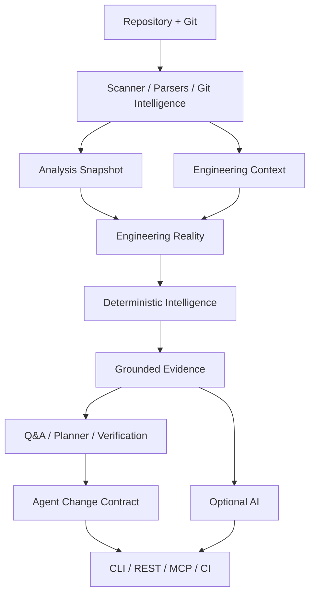

# CodeContext

**Deterministic engineering intelligence for Java and Kotlin repositories.**

[🌐 Explore the CodeContext website](https://sonii-shivansh.github.io/CodeContext-Website/) · [📚 Documentation](https://github.com/sonii-shivansh/CodeContext/tree/main/docs) · [🚀 Releases](https://github.com/sonii-shivansh/CodeContext/releases)

CodeContext is a Kotlin/JVM CLI and local REST application that analyzes source code, dependency structure, Git history, and engineering signals to produce reproducible engineering intelligence. It also provides grounded repository Q&A, evidence-backed engineering planning, a local MCP interface for AI agents, and a deterministic prepare → change → verify safety loop.

> **North-star direction:** CodeContext is evolving toward an explicit **engineering reality layer** that lets developers and AI agents reason about a repository state without silently mixing evidence from different states.

## Current status

The `main` branch currently contains the post-v0.6.0 engineering-intelligence work. The build version remains `0.6.0`; these changes have not yet been published as a new release.

Implemented on `main`:

- Java and Kotlin source analysis
- dependency graph construction
- PageRank knowledge hotspots
- cycle and architecture analysis
- Git authorship, churn, and evolution analysis
- learning-path generation
- deterministic change-impact analysis
- deterministic PR Intelligence
- Architecture Intelligence, architecture drift, and deterministic architecture contracts
- versioned analysis/evidence artifacts
- deterministic engineering-context snapshots and diffs
- deterministic Engineering Reality identity across analysis + repository state
- grounded repository Q&A retrieval
- deterministic, evidence-backed engineering planning
- evidence-first `prepare` workflow
- repository-bound **Agent Change Contract** artifacts with SHA-256 fingerprints
- deterministic `verify` workflow that validates the persisted contract, repository identity, prepared Git `HEAD`, plan binding, and change scope
- optional AI assistance over bounded repository-derived context
- local Ktor REST API
- local MCP stdio server for AI-agent integration
- path validation and rate limiting
- clean-environment end-to-end verification
- cross-platform distribution smoke verification for Linux x64, Windows x64, macOS x64, and macOS ARM64

Generated reports are self-contained and do not require a browser CDN request for their visualization code.

## Design principle

**Deterministic evidence first, AI reasoning second.**

Repository facts are produced by deterministic analysis. Grounded evidence preserves those facts for downstream Q&A, planning, agent workflows, and verification. AI is optional and is not treated as the authoritative source of repository truth.

## Quick start

For a released platform archive, extract it and run the launcher. Current release archives bundle the Java runtime, so Java 21/JAVA_HOME configuration is not required for normal use.

```text
Windows:  bin\\codecontext.bat --version
Linux/macOS: ./bin/codecontext --version
```

Then, from the repository you want to analyze:

```text
codecontext analyze .
codecontext reality . --json
```

The default report is written to `output/index.html`. Machine-readable artifacts are written under the analyzed repository's `output/` directory.

For source development:

```bash
git clone https://github.com/sonii-shivansh/CodeContext.git
cd CodeContext
./gradlew clean test
./gradlew installDist
./build/install/codecontext/bin/codecontext --version
```

## AI setup

AI is optional. When `ask` needs AI and no credential is configured, CodeContext can guide you through setup directly in the terminal. You can also use `GEMINI_API_KEY` or `GOOGLE_API_KEY` as environment variables for CI and non-interactive environments.

Use:

```bash
codecontext setup
codecontext doctor
```

Never commit API keys.

## CLI commands

```bash
# Repository analysis
codecontext analyze /path/to/repository

# Change impact
codecontext impact /path/to/repository src/main/Service.kt --json

# PR / change intelligence
codecontext pr-intelligence /path/to/repository --json
codecontext pr-intelligence /path/to/repository --base main --head feature/my-change --json

# Architecture intelligence and governance
codecontext architecture /path/to/repository --json
codecontext architecture-drift /path/to/repository --baseline /path/to/architecture-baseline.json --json
codecontext architecture-contract /path/to/repository --contract /path/to/.codecontext-architecture-contract.json --json

# Engineering context and repository state
codecontext context-snapshot /path/to/repository --json
codecontext context-diff /path/to/before.json /path/to/after.json --json
codecontext reality /path/to/repository --json

# Grounded repository Q&A
codecontext repo-qa "why is PaymentService risky?" --path /path/to/repository

# Evidence-backed change preparation and verification
codecontext prepare "add payment validation" --path /path/to/repository
codecontext verify --path /path/to/repository --plan output/engineering-plan.json --contract output/agent-change-contract.json

# Optional AI assistance
codecontext ask "What are the main architectural hotspots in this repository?"

# Git evolution
codecontext evolution /path/to/repository

# Local REST server
codecontext server --host 127.0.0.1 --port 8080

# AI-agent integration over MCP stdio
codecontext mcp
```

`prepare` writes three repository-scoped artifacts by default:

```text
output/engineering-context.json
output/engineering-plan.json
output/agent-change-contract.json
```

The contract is the persisted verification boundary. Do not replace it with a newly generated contract after preparation.

Recommended developer loop:

```text
codecontext analyze .
        ↓
codecontext reality . --json
        ↓
codecontext prepare "<change>"
        ↓
implement the change
        ↓
codecontext verify
        ↓
run tests / review findings
```

See [docs/CHANGE_SAFETY.md](docs/CHANGE_SAFETY.md) and [docs/ENGINEERING_REALITY.md](docs/ENGINEERING_REALITY.md).

## MCP / AI-agent integration

CodeContext exposes deterministic repository intelligence through a local MCP stdio server:

```bash
codecontext mcp
```

The current MCP surface includes repository analysis, impact analysis, architecture analysis, PR Intelligence, Engineering Reality, context snapshots/diffs, architecture drift/contracts, grounded evidence, preparation, change-safety evaluation, and change verification.

The MCP server is a trusted local integration. Repository paths are validated through the local path-safety boundary; remote repository URLs are rejected. The MCP server does not provide authentication or tenant isolation.

See [docs/MCP.md](docs/MCP.md) for the current tool contract.

## Architecture


```mermaid
flowchart TD
    A[Repository + Git] --> B[Scanner / Parsers / Git Intelligence]
    B --> C[Analysis Snapshot]
    B --> D[Engineering Context]
    C --> E[Engineering Reality]
    D --> E
    E --> F[Deterministic Intelligence]
    F --> G[Grounded Evidence]
    G --> H[Q&A / Planner / Verification]
    H --> I[Agent Change Contract]
    I --> J[CLI / REST / MCP / CI]
    G --> K[Optional AI]
    K --> J
```

## Configuration

The recommended path is `codecontext setup` or environment variables. A repository-local `.codecontext.json` remains supported for advanced settings. Never commit API keys.

For architecture governance, copy `.codecontext-architecture-contract.json.template` and customize its limits.

The server supports `CODECONTEXT_ALLOWED_PATHS`; keep allowed roots as narrow as practical.

## Data & privacy

CodeContext is local-first. With AI disabled, repository analysis and deterministic intelligence do not send repository content to a CodeContext telemetry or storage service. AI is opt-in and sends bounded repository-derived context directly to the configured provider when invoked.

Generated HTML reports are self-contained.

See [docs/DATA_PRIVACY.md](docs/DATA_PRIVACY.md).

## REST API

The local API provides health, analysis, reports, change-impact, PR Intelligence, repository Q&A/AI flows, and organization analysis. Local repository paths are validated against configured workspace roots; remote repository URLs are not accepted by the current local endpoints.

See [docs/API.md](docs/API.md).

The server does not currently provide authentication, tenant isolation, or deployment-level authorization. Those are responsibilities of a deployment boundary beyond trusted local use.

## Development and CI

```bash
./gradlew --no-daemon clean test
./gradlew --no-daemon build installDist
```

GitHub Actions is the project's authoritative clean-environment verification path. It validates compilation, tests, CLI flows, generated artifacts, intelligence flows, architecture governance, prepare/verify contracts, server health, API boundaries, cross-platform distribution smoke tests, and live-repository E2E behavior.

See:

- [Architecture](docs/ARCHITECTURE.md)
- [Engineering Reality](docs/ENGINEERING_REALITY.md)
- [API reference](docs/API.md)
- [MCP / AI-agent integration](docs/MCP.md)
- [Change Safety Loop](docs/CHANGE_SAFETY.md)
- [Data & Privacy](docs/DATA_PRIVACY.md)
- [PR Intelligence](docs/PR_INTELLIGENCE.md)
- [Development guide](docs/DEVELOPMENT.md)
- [Current implementation status](docs/ENTERPRISE_ROADMAP.md)
- [Contributing](CONTRIBUTING.md)
- [Security policy](SECURITY.md)

## License

CodeContext is released under the MIT License. See [LICENSE](LICENSE).
