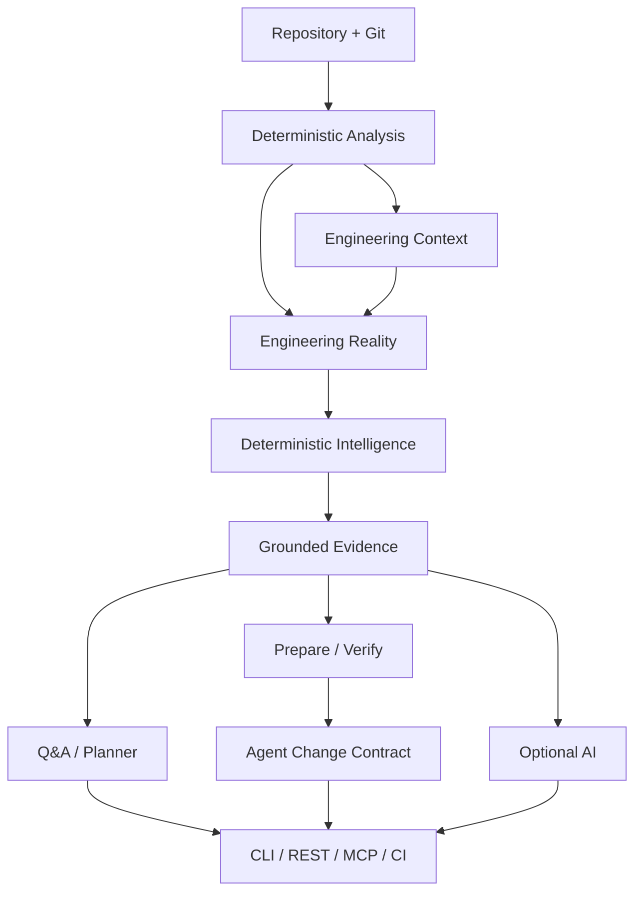

# CodeContext

**Deterministic engineering intelligence for Java and Kotlin repositories.**

[🌐 Website](https://sonii-shivansh.github.io/__VERICORE_EXTERNAL_VERICORE_WEBSITE__/) · [📚 Documentation](docs/INDEX.md) · [🚀 Releases](https://github.com/sonii-shivansh/Vericore/releases)

CodeContext is a Kotlin/JVM CLI and local REST application that analyzes source code, dependency structure, Git history, and engineering signals to produce reproducible engineering intelligence. It also provides grounded repository Q&A, evidence-backed engineering planning, a local MCP interface for AI agents, and a deterministic prepare → change → verify safety loop.

> **Core principle:** deterministic evidence first, optional AI reasoning second.

## Current status

**CodeContext `main` is the v0.7.0 release-candidate line.** The published release remains `v0.6.0` until the 0.7.0 release is created.

Implemented on `main`:

- Java and Kotlin source analysis
- dependency graph construction
- PageRank knowledge hotspots
- cycle and architecture analysis
- Git authorship, churn, and evolution analysis
- learning-path generation
- deterministic change-impact analysis
- deterministic PR Intelligence
- Architecture Intelligence, architecture drift, and deterministic architecture contracts
- versioned analysis/evidence artifacts
- deterministic engineering-context snapshots and diffs
- deterministic Engineering Reality identity across analysis + repository state
- grounded repository Q&A retrieval
- deterministic, evidence-backed engineering planning
- evidence-first `prepare` workflow
- repository-bound **Agent Change Contract** artifacts with SHA-256 fingerprints
- deterministic `verify` workflow against the persisted contract
- optional AI assistance over bounded repository-derived context
- local Ktor REST API
- local MCP stdio server for AI-agent integration
- path validation and rate limiting
- clean-environment end-to-end verification
- cross-platform distribution smoke verification for Linux x64, Windows x64, macOS x64, and macOS ARM64

## Quick start

**New to CodeContext? Start with [Getting Started](docs/GETTING_STARTED.md).**

### Use a released archive

Released platform archives bundle the Java runtime, so a separate Java installation is not required for normal end-user use.

```text
Windows:      bin\\codecontext.bat --version
Linux/macOS:  ./bin/codecontext --version
```

From the repository you want to analyze:

```text
codecontext analyze .
codecontext reality . --json
```

The default report is written to `output/index.html`. Machine-readable artifacts are written under the analyzed repository's `output/` directory.

### Build from source

```bash
git clone https://github.com/sonii-shivansh/Vericore.git
cd CodeContext
./gradlew --no-daemon clean test
./gradlew --no-daemon installDist
./build/install/vericore/bin/codecontext --version
```

## Common workflows

### Analyze a repository

```bash
codecontext analyze /path/to/repository
codecontext reality /path/to/repository --json
```

### Ask a grounded repository question

```bash
codecontext repo-qa "why is PaymentService risky?" --path /path/to/repository
```

AI is optional. Deterministic evidence remains the source of repository facts.

### Prepare and verify a change

```bash
codecontext prepare "add payment validation" --path /path/to/repository
```

Then implement the change and verify the original persisted contract:

```bash
codecontext verify \
  --path /path/to/repository \
  --plan output/engineering-plan.json \
  --contract output/agent-change-contract.json
```

`prepare` writes:

```text
output/engineering-context.json
output/engineering-plan.json
output/agent-change-contract.json
```

The persisted Agent Change Contract is the verification boundary. Do not replace it with a newly generated contract after preparation.

See [Change Safety](docs/CHANGE_SAFETY.md).

### Run the local REST server

```bash
codecontext server --host 127.0.0.1 --port 8080
```

```bash
curl --fail http://127.0.0.1:8080/health
```

Keep the server on loopback for local development. The application does not provide deployment-grade authentication, authorization, tenant isolation, or TLS.

See [API](docs/API.md).

### Integrate an AI agent with MCP

```bash
codecontext mcp
```

See [MCP](docs/MCP.md) for the current tool contract and safety boundary.

## CLI reference

```bash
# Repository analysis
codecontext analyze /path/to/repository

# Change impact
codecontext impact /path/to/repository src/main/Service.kt --json

# PR / change intelligence
codecontext pr-intelligence /path/to/repository --json
codecontext pr-intelligence /path/to/repository --base main --head feature/my-change --json

# Architecture intelligence and governance
codecontext architecture /path/to/repository --json
codecontext architecture-drift /path/to/repository --baseline /path/to/architecture-baseline.json --json
codecontext architecture-contract /path/to/repository --contract /path/to/.vericore-architecture-contract.json --json

# Engineering context and repository state
codecontext context-snapshot /path/to/repository --json
codecontext context-diff /path/to/before.json /path/to/after.json --json
codecontext reality /path/to/repository --json

# Grounded repository Q&A
codecontext repo-qa "why is PaymentService risky?" --path /path/to/repository

# Evidence-backed change preparation and verification
codecontext prepare "add payment validation" --path /path/to/repository
codecontext verify --path /path/to/repository --plan output/engineering-plan.json --contract output/agent-change-contract.json

# Optional AI assistance
codecontext ask "What are the main architectural hotspots in this repository?"

# Git evolution
codecontext evolution /path/to/repository

# Local REST server
codecontext server --host 127.0.0.1 --port 8080

# AI-agent integration over MCP stdio
codecontext mcp
```

For the complete developer workflow and implementation guidance, see [Development](docs/DEVELOPMENT.md).

## Architecture


```mermaid
flowchart TD
    R[Repository + Git] --> A[Deterministic Analysis]
    A --> C[Engineering Context]
    A --> E[Engineering Reality]
    C --> E
    E --> I[Deterministic Intelligence]
    I --> G[Grounded Evidence]
    G --> Q[Q&A / Planner]
    G --> V[Prepare / Verify]
    V --> K[Agent Change Contract]
    Q --> X[CLI / REST / MCP / CI]
    K --> X
    G --> AI[Optional AI]
    AI --> X
```

See [Architecture](docs/ARCHITECTURE.md) for the detailed system model and package boundaries.

## Configuration and privacy

The recommended setup path is:

```bash
codecontext setup
codecontext doctor
```

`GEMINI_API_KEY` and `GOOGLE_API_KEY` are supported for CI and non-interactive environments. Never commit API keys.

A repository-local `.vericore.json` remains supported for advanced settings. `VERICORE_ALLOWED_PATHS` controls server workspace boundaries; keep allowed roots as narrow as practical.

CodeContext is local-first. With AI disabled, deterministic repository analysis does not send repository content to a CodeContext telemetry or storage service. AI is opt-in and sends bounded repository-derived context directly to the configured provider when invoked.

See [Data & Privacy](docs/DATA_PRIVACY.md).

## Development and CI

```bash
./gradlew --no-daemon clean test
./gradlew --no-daemon build installDist
```

GitHub Actions is the authoritative clean-environment verification path. It validates compilation, tests, CLI flows, generated artifacts, intelligence flows, architecture governance, prepare/verify contracts, server/API boundaries, cross-platform distribution smoke tests, and live-repository E2E behavior.

For contributor workflow, see [Contributing](CONTRIBUTING.md) and [Development](docs/DEVELOPMENT.md).

## Documentation

| Topic | Document |
|---|---|
| Start here | [Getting Started](docs/GETTING_STARTED.md) |
| Documentation hub | [docs/INDEX.md](docs/INDEX.md) |
| Architecture | [docs/ARCHITECTURE.md](docs/ARCHITECTURE.md) |
| Engineering Reality | [docs/ENGINEERING_REALITY.md](docs/ENGINEERING_REALITY.md) |
| Change Safety | [docs/CHANGE_SAFETY.md](docs/CHANGE_SAFETY.md) |
| REST API | [docs/API.md](docs/API.md) |
| MCP / AI agents | [docs/MCP.md](docs/MCP.md) |
| PR Intelligence | [docs/PR_INTELLIGENCE.md](docs/PR_INTELLIGENCE.md) |
| Data & Privacy | [docs/DATA_PRIVACY.md](docs/DATA_PRIVACY.md) |
| Development | [docs/DEVELOPMENT.md](docs/DEVELOPMENT.md) |
| Implementation Status | [docs/ENTERPRISE_ROADMAP.md](docs/ENTERPRISE_ROADMAP.md) |
| Contributing | [CONTRIBUTING.md](CONTRIBUTING.md) |
| Security | [SECURITY.md](SECURITY.md) |

## License

CodeContext is released under the MIT License. See [LICENSE](LICENSE).
