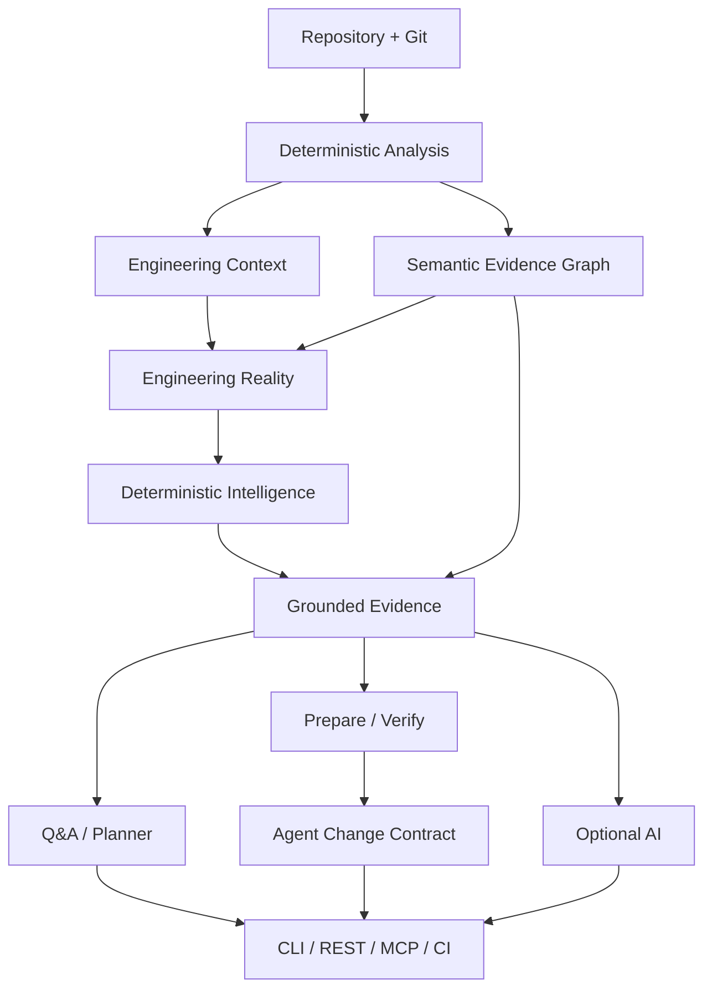

# Vericore

Vericore is a local-first engineering intelligence tool for understanding software repositories, grounding engineering decisions in deterministic evidence, and safely preparing repository changes.

## CLI reference

```bash
vericore analyze /path/to/repository
vericore impact /path/to/repository src/main/Service.kt --json
vericore pr-intelligence /path/to/repository --json
vericore pr-intelligence /path/to/repository --base main --head feature/my-change --json
vericore architecture /path/to/repository --json
vericore architecture-drift /path/to/repository --baseline /path/to/architecture-baseline.json --json
vericore architecture-contract /path/to/repository --contract /path/to/.vericore-architecture-contract.json --json
vericore context-snapshot /path/to/repository --json
vericore context-diff /path/to/before.json /path/to/after.json --json
vericore evidence-graph /path/to/repository --json
vericore reality /path/to/repository --json
vericore repo-qa "why is PaymentService risky?" --path /path/to/repository
vericore prepare "add payment validation" --path /path/to/repository
vericore verify --path /path/to/repository --plan output/engineering-plan.json --contract output/agent-change-contract.json
vericore ask "What are the main architectural hotspots in this repository?"
vericore evolution /path/to/repository
vericore server --host 127.0.0.1 --port 8080
vericore mcp
```

### Semantic evidence graph

`evidence-graph` materializes the deterministic semantic evidence graph already used by Engineering Reality and grounded intelligence:

```bash
vericore analyze /path/to/repository
vericore evidence-graph /path/to/repository --json
cat /path/to/repository/output/semantic-evidence-graph.json
```

The artifact is repository- and commit-bound, carries a stable SHA-256 graph digest, and contains deterministic node/edge ordering. It does not invent repository facts; it serializes evidence produced by Vericore's deterministic analysis and grounding layers.

## Architecture


```mermaid
flowchart TD
    R[Repository + Git] --> A[Deterministic Analysis]
    A --> C[Engineering Context]
    A --> G[Semantic Evidence Graph]
    C --> E[Engineering Reality]
    G --> E
    E --> I[Deterministic Intelligence]
    G --> Q[Grounded Evidence]
    I --> Q
    Q --> P[Q&A / Planner]
    Q --> V[Prepare / Verify]
    V --> K[Agent Change Contract]
    P --> X[CLI / REST / MCP / CI]
    K --> X
    Q --> AI[Optional AI]
    AI --> X
```

The semantic evidence graph is a bounded relationship layer over existing deterministic evidence. It is not a replacement for the dependency graph and does not act as an autonomous knowledge store.

See [Architecture](docs/ARCHITECTURE.md) for the detailed system model and package boundaries.

## Configuration and privacy

The recommended setup path is:

```bash
vericore setup
vericore doctor
```

`VERICORE_GEMINI_API_KEY` and `VERICORE_GOOGLE_API_KEY` are supported for CI and non-interactive environments. Never commit API keys.

A repository-local `.vericore.json` is the canonical configuration file. `VERICORE_ALLOWED_PATHS` controls server workspace boundaries; keep allowed roots as narrow as practical.

For users migrating from older releases, legacy configuration/environment names are accepted only as explicitly deprecated migration paths and are not part of the canonical Vericore contract.

Vericore is local-first. With AI disabled, deterministic repository analysis does not send repository content to a Vericore telemetry or storage service. AI is opt-in and sends bounded repository-derived context directly to the configured provider when invoked.

See [Data & Privacy](docs/DATA_PRIVACY.md).

## Development and CI

```bash
./gradlew --no-daemon clean test
```

GitHub Actions is the authoritative clean-environment execution path for release validation, including Linux, Windows, macOS, live repository tests, and deterministic release-gate checks.
