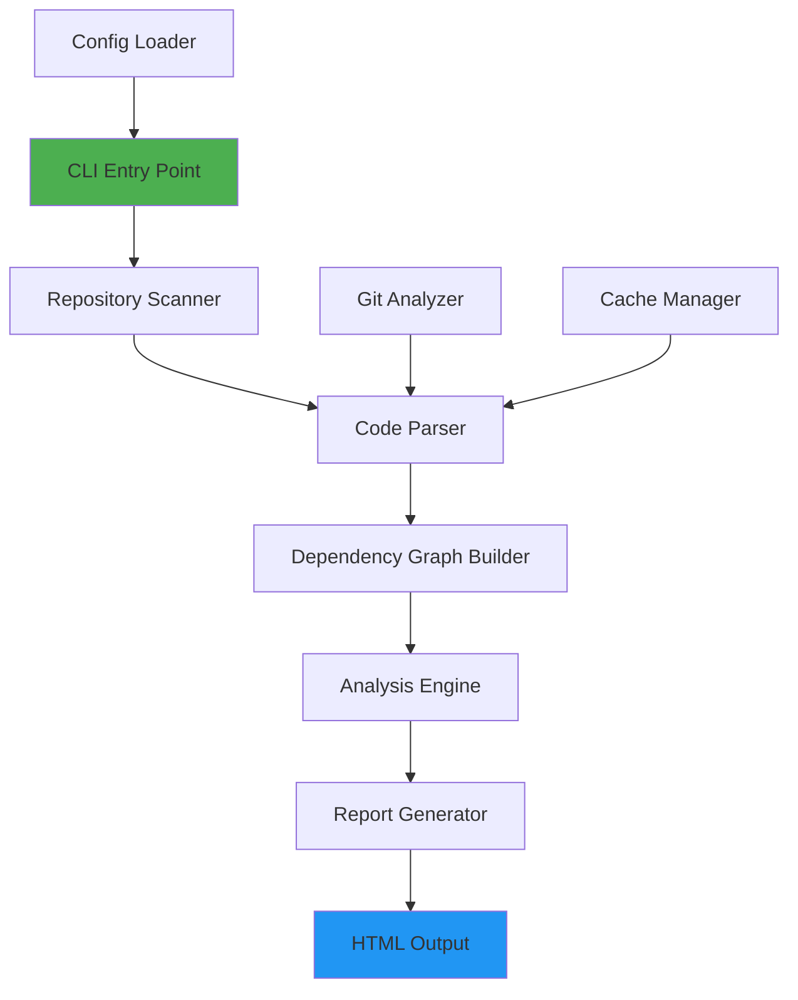

# Architecture Overview

## System Architecture

CodeContext is built as a modular, pipeline-based system that analyzes codebases and generates interactive reports.



---

## Core Components

### 1. CLI Layer (`cli/`)

**Purpose:** Command-line interface for user interaction

**Components:**
- `MainCommand.kt` - Root command handler
- `ImprovedAnalyzeCommand.kt` - Main analysis workflow
- `ServerCommand.kt` - REST API server
- `AIAssistantCommand.kt` - AI-powered insights
- `EvolutionCommand.kt` - Codebase evolution tracking

**Flow:**
```
User Input → Clikt Parser → Command Handler → Core Engine
```

---

### 2. Scanner Layer (`core/scanner/`)

**Purpose:** Discover and filter source files

**Components:**
- `RepositoryScanner.kt` - File discovery with gitignore support
- `OptimizedGitAnalyzer.kt` - Git history analysis

**Algorithm:**
1. Walk directory tree
2. Apply gitignore rules
3. Filter by file extension (.java, .kt)
4. Return list of source files

**Performance:** O(n) where n = total files in repository

---

### 3. Parser Layer (`core/parser/`)

**Purpose:** Extract metadata from source files

**Components:**
- `LanguageParser` - Interface for all parsers
- `JavaRealParser.kt` - Uses JavaParser library for AST parsing
- `KotlinRegexParser.kt` - Regex-based Kotlin parsing
- `ParserFactory.kt` - Factory pattern for parser selection
- `ParsedFile.kt` - Data model for parsed results

**Data Extracted:**
- Package name
- Import statements
- Class/file descriptions (from KDoc/Javadoc)
- Git metadata (via GitAnalyzer)

**Parallel Processing:**
```kotlin
// CodeParallelParser uses coroutines for performance
files.chunked(100).flatMap { chunk ->
    chunk.map { file ->
        async(Dispatchers.IO) {
            parser.parse(file)
        }
    }.awaitAll()
}
```

---

### 4. Graph Layer (`core/graph/`)

**Purpose:** Build and analyze dependency relationships

**Component:** `RobustDependencyGraph.kt`

**Algorithm:**

1. **Build Phase:**
   ```
   For each file:
     - Add as vertex
     - Create FQCN → file path mapping
   
   For each import:
     - Resolve to target file
     - Add directed edge (source → target)
   ```

2. **Analysis Phase:**
   ```
   - Run PageRank algorithm (damping=0.85, iterations=100)
   - Detect cycles using CycleDetector
   - Calculate importance scores
   ```

**Graph Structure:**
- **Vertices:** File absolute paths
- **Edges:** Import dependencies
- **Algorithm:** JGraphT library

**PageRank Scoring:**
```
score(file) = (1-d)/N + d * Σ(score(incoming) / outgoing_count(incoming))
```
Where d=0.85 (damping factor)

---

### 5. Generator Layer (`core/generator/`)

**Purpose:** Create learning paths for developers

**Component:** `LearningPathGenerator.kt`

**Algorithm:**
1. Reverse topological sort (dependencies first)
2. Filter by complexity (simple → complex)
3. Prioritize by PageRank score
4. Generate ordered reading list

**Output:** List of `LearningStep` with reasoning

---

### 6. Output Layer (`output/`)

**Purpose:** Generate interactive HTML reports

**Component:** `ReportGenerator.kt`

**Features:**
- D3.js force-directed graph
- Knowledge hotspots section
- Learning path display
- Team contribution map
- Interactive tooltips with context

**Data Flow:**
```
Graph + ParsedFiles → JSON serialization → HTML template → D3.js rendering
```

---

### 7. Cache Layer (`core/cache/`)

**Purpose:** Speed up re-analysis

**Component:** `CacheManager.kt`

**Strategy:**
- Cache key: File path + last modified timestamp
- Storage: JSON files in `.codecontext/` directory
- Invalidation: Automatic on file modification

**Performance Gain:** ~70% faster on re-analysis

---

### 8. Server Layer (`server/`)

**Purpose:** REST API for programmatic access

**Component:** `CodeContextServer.kt`

**Endpoints:**
- `POST /analyze` - Trigger analysis
- `GET /report/:id` - Retrieve report
- `GET /health` - Health check

**Technology:** Ktor framework

---

## Data Flow

### Complete Analysis Pipeline

```
1. User runs: ./gradlew run --args="analyze /path"
                    ↓
2. CLI parses arguments → ImprovedAnalyzeCommand
                    ↓
3. RepositoryScanner finds files (with gitignore)
                    ↓
4. CodeParallelParser parses files (parallel)
   ├─ JavaRealParser (for .java)
   └─ KotlinRegexParser (for .kt)
                    ↓
5. OptimizedGitAnalyzer enriches with Git data
                    ↓
6. RobustDependencyGraph builds graph
   ├─ Create vertices (files)
   ├─ Create edges (imports)
   └─ Run PageRank
                    ↓
7. LearningPathGenerator creates reading order
                    ↓
8. ReportGenerator creates HTML
   ├─ Serialize graph to JSON
   ├─ Generate HTML with kotlinx.html
   └─ Embed D3.js visualization
                    ↓
9. Output: output/index.html
```

---

## Design Patterns

### 1. Factory Pattern
- `ParserFactory` - Creates appropriate parser based on file extension

### 2. Strategy Pattern
- `LanguageParser` interface - Different parsing strategies per language

### 3. Builder Pattern
- `RobustDependencyGraph` - Builds graph incrementally

### 4. Pipeline Pattern
- Entire analysis flow - Sequential stages with data transformation

---

## Technology Stack

| Layer | Technology | Purpose |
|-------|------------|---------|
| **Language** | Kotlin 2.1.0 | Type-safe, concise, coroutines |
| **CLI** | Clikt | Command-line parsing |
| **Parsing** | JavaParser | Java AST parsing |
| **Graphs** | JGraphT | Graph algorithms (PageRank) |
| **Git** | JGit | Git history analysis |
| **HTML** | kotlinx.html | Type-safe HTML generation |
| **Visualization** | D3.js | Interactive force graphs |
| **Server** | Ktor | REST API framework |
| **Testing** | Kotest | Property-based testing |
| **Serialization** | kotlinx.serialization | JSON handling |

---

## Performance Characteristics

### Time Complexity

| Operation | Complexity | Notes |
|-----------|------------|-------|
| File Scanning | O(n) | n = total files |
| Parsing | O(n) | Parallelized |
| Graph Building | O(n + e) | n = files, e = imports |
| PageRank | O(k * (n + e)) | k = iterations (100) |
| Report Generation | O(n + e) | JSON serialization |

### Space Complexity

- **Graph:** O(n + e) - Vertices + edges
- **Cache:** O(n) - One entry per file
- **Output:** O(n + e) - HTML with embedded data

### Scalability

- **Small projects** (<100 files): <1 second
- **Medium projects** (100-1000 files): 1-5 seconds
- **Large projects** (1000-10000 files): 5-30 seconds
- **Very large** (>10000 files): May require optimization

---

## Extension Points

### Adding New Language Support

1. Create parser implementing `LanguageParser`:
```kotlin
class PythonParser : LanguageParser {
    override fun parse(file: File): ParsedFile {
        // Extract package, imports, description
    }
}
```

2. Register in `ParserFactory`:
```kotlin
"py" -> pythonParser
```

3. Add tests in `src/test/kotlin/`

### Adding New Analysis

1. Create analyzer in `core/analyzer/`:
```kotlin
class ComplexityAnalyzer {
    fun analyze(files: List<ParsedFile>): Map<String, Int> {
        // Calculate complexity metrics
    }
}
```

2. Integrate in `ImprovedAnalyzeCommand`

3. Update `ReportGenerator` to display results

---

## Security Considerations

1. **No Code Execution:** Only parses, never executes analyzed code
2. **Local Processing:** All analysis happens locally, no external calls
3. **Git Safety:** Read-only Git operations
4. **Path Traversal:** Validates file paths within repository bounds
5. **Resource Limits:** Configurable max files to prevent memory exhaustion

---

## Future Architecture Plans

1. **Plugin System:** Allow custom analyzers
2. **Incremental Analysis:** Only re-analyze changed files
3. **Distributed Processing:** Analyze across multiple machines
4. **Real-time Updates:** Watch mode for live analysis
5. **Database Backend:** Store analysis history
