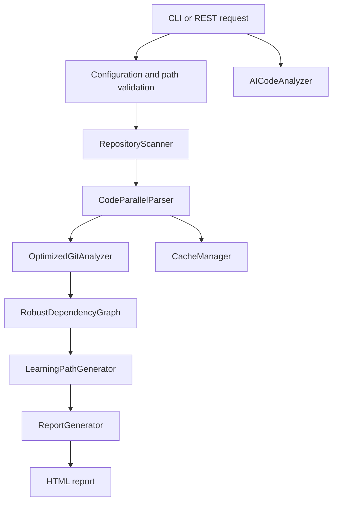

# Architecture

## Purpose

CodeContext is a local-first analysis pipeline. It transforms Java and Kotlin source files into dependency metadata, Git context, graph metrics, learning guidance, and an interactive HTML report.

## System shape


```mermaid
graph TD
    A[CLI or REST request] --> B[Configuration and path validation]
    B --> C[RepositoryScanner]
    C --> D[CodeParallelParser]
    D --> E[OptimizedGitAnalyzer]
    E --> F[RobustDependencyGraph]
    F --> G[LearningPathGenerator]
    G --> H[ReportGenerator]
    H --> I[HTML report]
    D --> J[CacheManager]
    A --> K[AICodeAnalyzer]
```

## Runtime flows

### CLI analysis

`Main.kt` registers Clikt commands. `ImprovedAnalyzeCommand` loads configuration, scans the target directory, parses supported source files, enriches results with Git metadata, builds the dependency graph, computes PageRank, generates a learning path, and writes `output/index.html`.

### REST analysis

`CodeContextServer.module()` configures JSON handling, rate limiting, health routes, report serving, and analysis routes. `AnalysisLogic.analyze()` uses the same configuration model as the scanner and enforces `maxFilesAnalyze`. Reports are written under `output/` using random identifiers and are exposed through `/reports/{id}.html`.

### AI analysis

`AICodeAnalyzer` supports configured Gemini and Anthropic providers. It creates structured JSON requests, keeps credentials in headers, redacts common secrets from prompt content, validates provider responses, sanitizes errors, and clamps confidence values. AI calls are external network operations and are disabled by default.

## Core components

### Scanning

`RepositoryScanner` walks a repository and includes `.kt` and `.java` files. Directory exclusions come from `CodeContextConfig.excludePaths` and are matched by path segment. The scanner does not execute source files.

### Parsing

`ParserFactory` selects a parser by extension. `JavaRealParser` uses JavaParser-based AST handling. `KotlinRegexParser` provides lightweight Kotlin parsing and intentionally has limitations for complex syntax. `CodeParallelParser` coordinates parallel parsing and cache access.

### Git analysis

`OptimizedGitAnalyzer` enriches parsed files with modification time, change frequency, authors, and recent commit information. Git operations are read-only from the application's perspective.

### Dependency graph

`RobustDependencyGraph` stores absolute file paths as vertices and import relationships as directed edges. It builds a fully indexed package map for wildcard imports, detects cycles, and calculates PageRank with JGraphT. A graph instance is reset before each build so repeated use cannot retain stale vertices or scores.

### Learning paths

`LearningPathGenerator` orders files using dependency relationships, complexity, and graph importance to produce a practical onboarding sequence.

### Caching

`CacheManager` stores serialized parse results in `.codecontext/cache` by default. Cache keys include the canonical file path and a SHA-256 content hash, so same-size or timestamp-preserving edits invalidate correctly. Writes use a temporary file and atomic replacement when supported.

### Reports

`ReportGenerator` produces an HTML report using kotlinx.html and serialized graph data for a Force Graph visualization. Reports include hotspots, learning paths, Git contribution context, and dependency relationships. The report includes a remote visualization dependency; deployments requiring strict offline or supply-chain controls should self-host and pin that asset.

### Organization analysis

`OrganizationAnalyzer` processes multiple repositories with structured coroutines and a semaphore-based concurrency limit. Each repository uses the shared configuration and file-count policy, and a failed repository produces an isolated result rather than cancelling unrelated work.

## Data model

```text
File -> ParsedFile -> Graph vertex/edge data -> Report
                    \-> GitMetadata
                    \-> CacheManager
```

`ParsedFile` contains the file path, package name, imports, description, and `GitMetadata`. The graph uses parsed imports to resolve local classes and package wildcard relationships.

## Security boundaries

- Source code is parsed, not executed.
- Local server paths are canonicalized and constrained to allowed roots.
- File-count limits and rate limits reduce resource abuse.
- Reports use random identifiers rather than repository names or filesystem paths.
- AI credentials are sent in provider headers and are redacted from prompt content where recognizable.
- AI providers are external services and may receive repository-derived context when enabled.
- The server does not provide authentication, tenant isolation, report authorization, or report retention by itself.
- CORS is not enabled by default; trusted deployments must configure browser access at their edge.

## Performance characteristics

For `n` source files, scanning and parsing are approximately linear in the number of files, graph construction is approximately `O(n + e)` for `e` resolved relationships, and PageRank is bounded by the configured iteration count. Organization analysis intentionally limits concurrent repositories to avoid unbounded CPU and memory pressure.

Actual performance depends on repository size, parser complexity, Git history, cache state, and available hardware.

## Extension points

- Add a parser through `LanguageParser` and `ParserFactory`.
- Add analysis metrics under `core/` and integrate them into the CLI/report pipeline.
- Add report sections through `ReportGenerator`.
- Add API routes in `CodeContextServer` with explicit validation and sanitized errors.

Future work includes incremental analysis, watch mode, plugin APIs, improved Kotlin parsing, authenticated report hosting, and additional language support.
