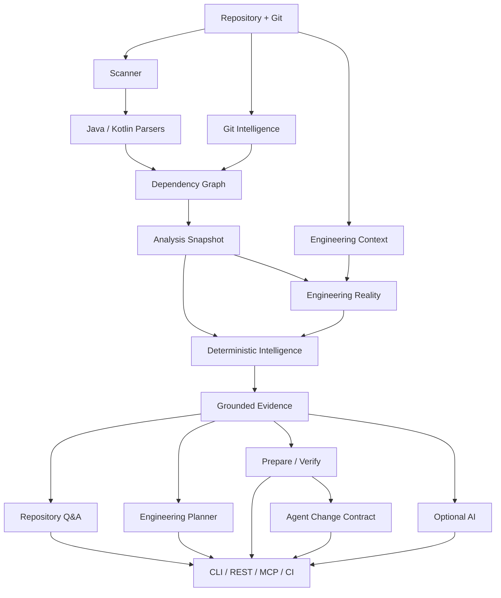
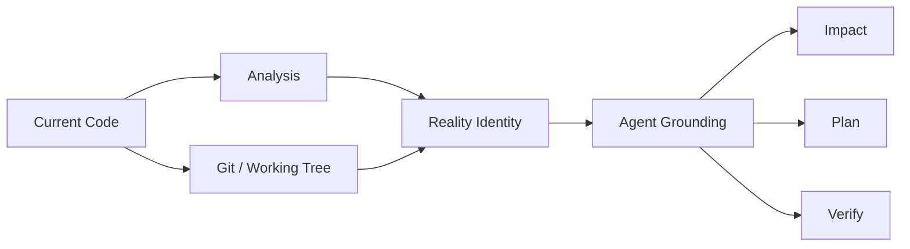

# CodeContext Architecture

## Contents

- [System model](#system-model)
- [Layer responsibilities](#layer-responsibilities)
- [Engineering Reality](#engineering-reality)
- [Prepare / Verify safety boundary](#prepare--verify-safety-boundary)
- [Source layout](#source-layout)
- [Trust boundaries](#trust-boundaries)
- [Determinism](#determinism)
- [Extension points](#extension-points)

## System model

CodeContext is a local-first engineering-intelligence pipeline for Java and Kotlin repositories. It transforms source code, Git history, dependency structure, and engineering signals into deterministic analysis, grounded evidence, repository Q&A, engineering plans, reports, and optional AI-assisted reasoning.


```mermaid
flowchart TD
    R[Repository + Git] --> S[Scanner]
    S --> P[Java / Kotlin Parsers]
    R --> G[Git Intelligence]
    P --> D[Dependency Graph]
    G --> D
    D --> A[Analysis Snapshot]
    R --> C[Engineering Context]
    A --> ER[Engineering Reality]
    C --> ER
    A --> I[Deterministic Intelligence]
    ER --> I
    I --> E[Grounded Evidence]
    E --> Q[Repository Q&A]
    E --> PL[Engineering Planner]
    E --> V[Prepare / Verify]
    V --> CT[Agent Change Contract]
    E --> AI[Optional AI]
    Q --> X[CLI / REST / MCP / CI]
    PL --> X
    V --> X
    CT --> X
    AI --> X
```

## Layer responsibilities

### Repository boundary

`RepositoryScanner` discovers supported Java and Kotlin source files while enforcing configured exclusions and file limits. Source is parsed rather than executed.

`ParserFactory` selects a parser by extension. Java uses JavaParser-based analysis. Kotlin uses the project's current lightweight Kotlin parsing support and therefore has known complex-syntax limitations.

`OptimizedGitAnalyzer` supplies change frequency, modification time, authorship, and recent-change context. Git operations are read-only.

### Dependency graph

`RobustDependencyGraph` resolves local dependency relationships, wildcard imports, cycles, and PageRank. The graph is rebuilt for each analysis to avoid stale state.

### Analysis snapshot

`AnalysisSnapshot` is the machine-readable boundary between low-level analysis and higher-level intelligence. It contains repository metrics, file facts, hotspots, and architecture facts.

### Deterministic intelligence

Current deterministic engines cover risk, dependency-aware impact, PR Intelligence, Architecture Intelligence, architecture drift, architecture contracts, Git evolution, hotspots, learning paths, and engineering-context changes.

### Engineering Reality

`core/reality/EngineeringReality.kt` is a composition boundary, not another analyzer. It binds an `AnalysisSnapshot` and an `EngineeringContextSnapshot` into one explicit state identity.

The reality digest deliberately excludes analysis wall-clock time. If repository state and deterministic facts are unchanged, repeated analysis should not manufacture a new reality identity.

This layer is intentionally small so future evidence domains can be added without making AI responsible for deciding which artifacts belong together.

See [Engineering Reality](ENGINEERING_REALITY.md).

### Grounded evidence

`GroundedEvidenceBuilder` converts deterministic analysis into bounded `EvidenceCitation` records. Citation IDs are stable within the generated evidence set, and paths exposed through evidence are repository-relative.

`GroundedAIService` can pass bounded evidence to the configured AI provider. AI is optional and does not replace deterministic repository facts.

### Repository Q&A

`RepositoryQuestionClassifier` classifies repository-question intents. `RepositoryEvidenceRetriever` extracts and ranks relevant evidence with deterministic ordering and bounded result counts.

### Engineering planner

`EngineeringPlanner` consumes grounded evidence and produces a structured, versioned engineering plan containing affected components, risk, implementation steps, evidence IDs, verification criteria, uncertainty, and a contract fingerprint. The planner is read-only.

## Engineering Reality


```mermaid
flowchart LR
    A[Current Code] --> B[Analysis]
    A --> C[Git / Working Tree]
    B --> D[Reality Identity]
    C --> D
    D --> E[Agent Grounding]
    E --> F[Impact]
    E --> G[Plan]
    E --> H[Verify]
```

> **AI reasoning is downstream of deterministic repository evidence.**

The reality artifact currently contains no model-generated claims and no autonomous actions.

## Prepare / Verify safety boundary

The prepare/verify workflow is a deterministic application layer over the intelligence contracts:

```text
prepare
  ↓
engineering context + evidence + plan
  ↓
repository-bound AgentChangeContract
  ↓
agent/developer changes working tree
  ↓
verify against persisted contract
  ↓
scope + repository identity + prepared HEAD + plan binding
  ↓
impact + PR + architecture signals
```

`AgentChangeContract` records the canonical repository path, prepared Git `HEAD`, planned paths, expected components, verification commands, evidence IDs, architecture expectations, and a SHA-256 fingerprint. `PrepareCommand` persists the contract as `output/agent-change-contract.json`.

The CLI verification path loads that persisted contract and rejects missing, tampered, mismatched, cross-repository, or stale contracts. The workflow does not modify source code. See [Change Safety](CHANGE_SAFETY.md).

**Current implementation note:** the core API still exposes a compatibility overload that can derive a contract from a supplied plan, and the MCP `codecontext_get_change_contract` helper currently prepares a fresh contract for a requested change summary. These are compatibility/preview paths, not the persisted-contract verification path. A future hardening change should remove ambiguity by making persisted-contract verification the only verification entry point and making MCP contract retrieval explicitly artifact-based.

## Source layout

The package structure is capability-oriented:

```text
com.codecontext/
├── Main.kt
├── cli/                  # user-facing command adapters
├── core/
│   ├── ai/               # optional provider integrations
│   ├── cache/            # analysis cache
│   ├── config/           # configuration + credentials
│   ├── exceptions/       # domain/application errors
│   ├── generator/        # learning/report generation helpers
│   ├── graph/            # dependency graph algorithms
│   ├── intelligence/     # deterministic engineering intelligence
│   ├── parser/           # language parsing contracts + implementations
│   ├── planner/          # deterministic engineering planning
│   ├── qa/               # repository question/retrieval logic
│   ├── reality/          # cross-artifact engineering-state identity
│   ├── scanner/          # repository discovery + Git signals
│   ├── temporal/         # history/evolution analysis
│   └── workflow/         # prepare/verify and change-safety contracts
├── enterprise/           # bounded organization-oriented capabilities
├── mcp/                  # local MCP protocol adapter
├── output/               # report-generation implementation
└── server/               # local REST boundary
```

Architecture rule for new code:

> **CLI/server/MCP adapters orchestrate; deterministic domain logic belongs under `core`; provider-specific AI code remains behind an explicit boundary.**

Large folder moves are deferred until a concrete dependency problem justifies them. Moving files for aesthetics alone would increase churn without improving correctness.

## Trust boundaries

The Ktor server exposes local analysis and intelligence flows. Repository paths are canonicalized and checked against configured allowed roots. Rate limiting is enabled by default.

The current server is intended for trusted local/internal deployment. Authentication, authorization, tenant isolation, TLS, and external deployment controls are not provided by the application itself.

AI credentials are configuration data and must not be embedded in evidence artifacts. External AI calls are opt-in.

The MCP server is a trusted local integration. It uses the same path-safety boundary and does not provide remote-repository access, authentication, or tenant isolation.

## Determinism

Deterministic artifacts should:

1. have explicit schema versions;
2. sort collections before hashing or emitting machine-readable results;
3. avoid wall-clock timestamps in identity digests;
4. expose unknown state instead of fabricating facts;
5. preserve provenance where a repository commit or baseline is available.

## Extension points

- add parsers through `LanguageParser` and `ParserFactory`;
- add deterministic intelligence under `core/intelligence`;
- compose cross-artifact identities under `core/reality`;
- add evidence types without changing existing evidence semantics;
- add retrieval/planning rules with deterministic ordering;
- add workflow contracts under `core/workflow`;
- add CLI/REST/MCP adapters around application services;
- extend AI providers behind the existing provider boundary.
