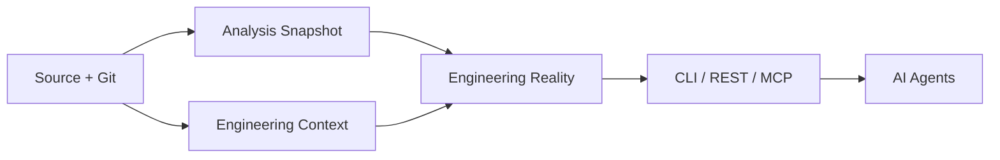
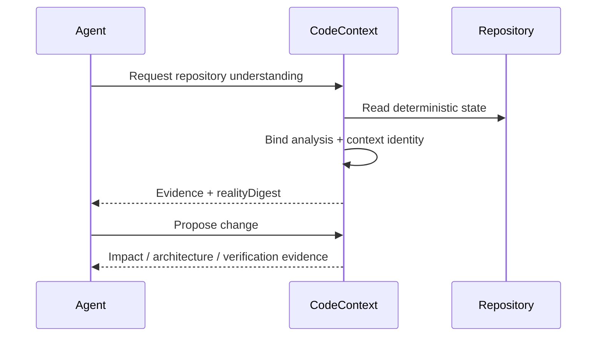

# Engineering Reality

> **Status:** Implemented as the deterministic foundation for future agent grounding.

Engineering Reality is CodeContext's composition layer for answering:

> **Which repository facts belong to the same engineering state?**

It does not replace analysis, architecture, Git, or AI. It binds deterministic artifacts together with explicit schema versions and digests.

## Contents

- [Why it exists](#why-it-exists)
- [Pipeline](#pipeline)
- [Artifact contract](#artifact-contract)
- [CLI](#cli)
- [AI-agent use](#ai-agent-use)
- [Roadmap](#roadmap)

## Why it exists

A repository has several valid views of reality: source/dependency analysis, file state, Git state, architecture findings, historical evidence, and eventually engineering decisions. Passing these independently to an AI agent creates an easy failure mode: the agent can accidentally combine artifacts produced from different repository states.

Engineering Reality introduces an explicit identity boundary.

## Pipeline



<details>
<summary><strong>Deterministic by design</strong></summary>

The reality artifact is derived only from deterministic repository artifacts. AI is not involved in creating the identity or deciding repository facts.

</details>

## Artifact contract

| Field | Meaning |
|---|---|
| `repositoryCommit` | Git `HEAD` when available |
| `languages` | Languages observed by analysis/context |
| `fileCount` | Files included by analysis |
| `graphNodes` / `graphEdges` | Dependency graph size |
| `parseFailures` | Files that did not parse |
| `hasCycles` | Whether dependency cycles were detected |
| `packageCount` | Packages represented in the analysis |
| `crossPackageEdges` | Cross-package dependency edges |
| `hotspotCount` | Retained analysis hotspots |
| `dirty` | Whether the working tree has relevant changes |
| `changedPaths` | Current Git working-tree paths |
| `analysisDigest` | Digest of stable analysis content |
| `contextDigest` | Digest of repository-context content |
| `realityDigest` | Composite identity for the combined state |

The analysis timestamp is deliberately excluded from the identity. Re-running analysis without changing repository state must not manufacture a different reality identity.

## CLI

First create an analysis snapshot:

```bash
codecontext analyze .
```

Then create the combined reality artifact:

```bash
codecontext reality . --json
```

The artifact is written to:

```text
output/engineering-reality.json
```

The command is read-only: it does not modify source code, Git state, commits, or branches.

## AI-agent use



> **AI may reason over CodeContext evidence, but it does not define repository truth.**

## Roadmap

The current artifact is intentionally small. Future versions can compose additional deterministic identities:

1. architecture intelligence;
2. historical/temporal intelligence;
3. engineering decisions and provenance;
4. test/build evidence;
5. cross-repository system relationships;
6. organization-level ownership and contracts.

Each layer should be added only when its evidence contract is explicit and independently verifiable.
