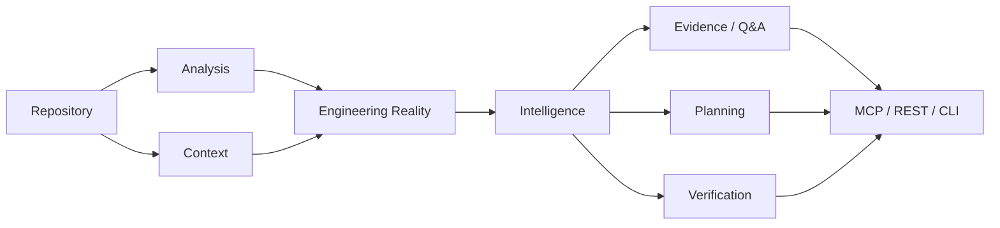

# CodeContext Documentation Hub

> A navigable map of the engineering system. Start here when you need to understand the project rather than a single feature.

## Architecture at a glance

## Documentation map

| Area | Document | Use it when |
|---|---|---|
| System design | [Architecture](ARCHITECTURE.md) | You need the component model or package boundaries |
| Repository state | [Engineering Reality](ENGINEERING_REALITY.md) | You need state identity and agent grounding |
| API | [API](API.md) | You are integrating with the local REST API |
| AI agents | [MCP](MCP.md) | You are integrating an MCP-compatible agent |
| Safe changes | [Change Safety](CHANGE_SAFETY.md) | You are preparing, implementing, or verifying a change |
| PR intelligence | [PR Intelligence](PR_INTELLIGENCE.md) | You are reviewing change risk and blast radius |
| Privacy | [Data & Privacy](DATA_PRIVACY.md) | You need to understand data boundaries |
| Development | [Development](DEVELOPMENT.md) | You are contributing to the project |
| Implementation status | [Current Status](ENTERPRISE_ROADMAP.md) | You need to know what is actually implemented |

<strong>Recommended reading paths</strong>

### New developer

`README → ARCHITECTURE → DEVELOPMENT → CHANGE_SAFETY`

### AI-agent integration

`ARCHITECTURE → ENGINEERING_REALITY → MCP → API → CHANGE_SAFETY`

### Contributor adding intelligence

`ARCHITECTURE → ENGINEERING_REALITY → PR_INTELLIGENCE → DEVELOPMENT`

### Security review

`DATA_PRIVACY → ARCHITECTURE → API → MCP → SECURITY.md`

## Documentation rule

Documentation must distinguish three things:

1. **Implemented** — verified by repository code/tests/CI.
2. **Design principle** — an architectural invariant or constraint.
3. **Future direction** — an idea that is not shipped.

Do not describe future capabilities as implemented functionality.

## Interactive documentation conventions

Where GitHub supports it, CodeContext documentation uses:

- Mermaid diagrams for architecture and sequence flows;
- `
` sections for optional deep dives;
- tables for stable contracts;
- explicit CLI examples;
- links between related contracts.

The goal is not decoration. Documentation should help a developer answer **what exists, why it exists, how to use it, and what is intentionally not implemented**.
